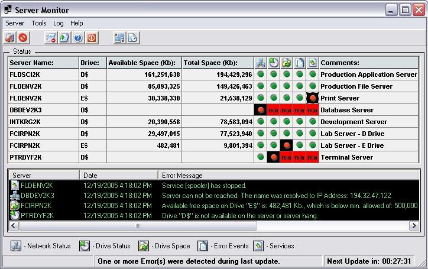

## Server Monitor 2\.0

### Description

Server Monitor is a utility for Windows system administrators. The main purpose of it is to monitor and intercept error type events occurred on the W2K/W2k3 servers. Events such as Server is Down, Drive is not available, free space on the drive falls below preset limit are intercepted. Servers query interval can be set from 1 minute to 24 hours. Monitor can send an Email or Page (if available) with error summary. Optionally Monitor can intercept Error type events from the Application and/or System Log on servers.

New for version 2.0: MS Access database, Services Monitor, optional SMTP authentication, SysTray Icon.
 
### More Info
 

             |
---                |---
**Submitted On**   |2006-01-02 11:47:24
**By**             |[Gurgen Alaverdian](https://github.com/Planet-Source-Code/PSCIndex/blob/master/ByAuthor/gurgen-alaverdian.md)
**Level**          |Advanced
**User Rating**    |5.0 (15 globes from 3 users)
**Compatibility**  |VB 6\.0
**Category**       |[Complete Applications](https://github.com/Planet-Source-Code/PSCIndex/blob/master/ByCategory/complete-applications__1-27.md)
**World**          |[Visual Basic](https://github.com/Planet-Source-Code/PSCIndex/blob/master/ByWorld/visual-basic.md)
**Archive File**   |[Server\_Mon196167122006\.zip](https://github.com/Planet-Source-Code/gurgen-alaverdian-server-monitor-2-0__1-63895/archive/master.zip)

